# ValiGuard AI: Anomaly Detection & Real-Time Security Monitoring for Blockchain

**Department of Software Engineering, The University of Lahore, Final Year Project Documentation.**

**Project ID:** FYP-F25-14 
**Session:** Spring 2023-2027 
Version 1.0

Department of Software Engineering
The University of Lahore
Lahore, Pakistan

---

## Abstract
Cross-chain bridges suffered over $2.5 billion in exploits in 2022 due to the "semantic blindness" of blockchain validators, who verify cryptographic signatures but cannot assess the contextual risk of transactions. To close this vulnerability, we developed the system that leverages Python-driven orchestration, a Flask API, and an unsupervised Isolation Forest machine learning pipeline to analyze real-time transaction data via Tendermint RPC. By evaluating volume, frequency, and temporal patterns, it computes dynamic risk scores to flag anomalous behavior before final settlement occurs.

The implementation provides a unified Next.js dashboard that delivers real-time operational telemetry and categorizes threats by severity with incredibly low latency. Furthermore, the platform's modular AI core allows for seamless future upgrades, such as implementing Graph Neural Networks, without requiring structural refactoring. Ultimately, ValiGuard AI transforms validators from passive infrastructure providers into active security guardians, shifting the industry's defense paradigm from post-incident forensics to real-time anomaly interception.

---

## Area of Project
The project falls under the areas of Artificial Intelligence, Blockchain Technology, Web Application, Cybersecurity.

## Technologies Used
The project utilizes Python, Flask, Next.js, React, Scikit-learn, NumPy, SQLAlchemy, Alembic, PostgreSQL, SQLite, Tendermint RPC, Ethers.js, Tailwind CSS, Bash, Nginx.

---

## Chapter 1: Introduction to the Problem

### 1.1 Introduction
The advent of Web3 and decentralized finance (DeFi) has catalyzed a paradigm shift from isolated, single-chain ecosystems to an interconnected, multi-chain landscape. At the core of this interoperability are cross-chain bridges: protocols that facilitate the transfer of assets and data across disparate blockchain networks. While these bridges are fundamental to the scalability and utility of the decentralized web, they have simultaneously emerged as the most critical vector for systemic vulnerability.

In 2022 alone, cross-chain bridge exploits accounted for approximately 2.5 billion dollat in lost assets, representing 70% of all crypto-related thefts that year. High-profile catastrophes, such as the Ronin Network (625M) and Wormhole (325M) breaches, underscore a fundamental flaw in the current security architecture. While the underlying cryptographic primitives of blockchains remain robust, the operational logic and validation mechanisms governing cross-chain state transitions are highly susceptible to manipulation.

Historically, network security has relied on reactive measures, such as post-hoc audits, bug bounties, and forensic investigations, that address vulnerabilities only after capital has been exfiltrated. The current paradigm places blockchain validators in a position of "semantic blindness." Validators mathematically verify the legitimacy of cryptographic signatures, but possess no operational visibility into the intent or context of the transactions they are ratifying. Consequently, by the time a bridge exploit is reflected on-chain, the malicious transaction has already achieved finality. There exists a critical research and engineering gap for proactive, real-time threat detection mechanisms that operate at the validator layer before final settlement is achieved.

### 1.2 Purpose
The primary purpose of this research is to transition blockchain validators from passive infrastructure providers to active security guardians. Currently, the validation process is strictly syntactic, devoid of contextual risk assessment. The purpose of ValiGuard Al is to inject semantic visibility into the validation lifecycle.

By equipping validator nodes with an intelligent monitoring layer, this research aims to detect anomalous cross-chain behavior in real-time. This includes sudden liquidity drains, abnormal volume spikes, or interactions with flagged wallet clusters. The ultimate purpose is to provide an early-warning system that identifies zero-day exploits and attack vectors as they manifest in the mempool or early block propagation, thereby preventing irreversible financial damage before consensus is finalized. Additionally, this research aims to democratize validator security by automating the complex orchestration of node setup. This ensures that robust security infrastructure is accessible not just to institutional operators, but to independent validators across the QIE Blockchain network.

### 1.3 Objective
To fulfill the identified purpose, this research proposes the following specific and measurable objectives:
1.  To design and implement a Real-Time Security Monitoring System capable of ingesting and inspecting cross-chain bridge transactions on the QIE network with sub-100ms latency.
2.  To develop an Unsupervised Anomaly Detection Pipeline utilizing machine learning algorithms (e.g., Isolation Forests) to calculate dynamic risk scores (0-100) based on deviations from historical transaction baselines, including volume, frequency, and temporal patterns.
3.  To architect a Unified Validator Dashboard that synthesizes operational node health (sync status, voting power) and security telemetry (color-coded risk alerts) into a single, cognitive-load-optimized interface.
4.  To engineer Automated Node Orchestration via Python-driven scripts that abstract the complexity of QIE Network V3 validator deployment, configuration, and synchronization.

### 1.4 Existing Solutions
A review of the current landscape reveals several platforms attempting to address blockchain security; however, significant limitations remain concerning validator-centric, real-time anomaly detection.
1.  **Forta Network:** Forta operates as a decentralized monitoring network where developers deploy specific detection "bots" to scan for predefined attack patterns.
    *   **Limitation:** Forta relies heavily on signature-based detection for known vulnerabilities and requires manual bot development. It struggles to detect novel, zero-day anomalies via unsupervised learning and is not natively integrated into the validator's operational workflow.
2.  **Hypernative:** Hypernative utilizes predictive Al to monitor off-chain and on-chain data, aiming to preemptively block exploits.
    *   **Limitation:** While highly effective, Hypernative operates as a proprietary, closed-source SaaS platform. It creates vendor lock-in and is not natively tailored to the specific architectural nuances of the QIE Blockchain validator ecosystem.
3.  **Tenderly:** Tenderly is a comprehensive Web3 development platform offering real-time alerting, transaction simulation, and forensic analysis.
    *   **Limitation:** Tenderly is fundamentally developer-centric, focused on smart contract debugging and simulation rather than providing a real-time, ML-driven risk-scoring feed tailored for the operational decision-making of a network validator.

**Identified Research Gap:** Current solutions are either purely reactive, require explicit rule-setting for known attacks, or operate as closed external SaaS platforms disconnected from the validator's immediate operational environment. There is no open, natively integrated solution that combines automated validator infrastructure orchestration with an unsupervised, real-time Al anomaly detection layer specifically designed for cross-chain bridge traffic.

### 1.5 Proposed Solution
To address the limitations identified in the existing literature and commercial landscape, this research proposes ValiGuard AI, an intelligent security dashboard and orchestration engine designed natively for the QIE Blockchain ecosystem.

ValiGuard AI introduces a novel, multi-layered architecture that fuses infrastructure automation with proactive threat intelligence:
1.  **Blockchain Source and Ingestion Layer:** A direct integration with the QIE Mainnet via Tendermint RPC interfaces allows the system to ingest raw block data and monitor the mempool for pending transactions before they are committed to a block.
2.  **Al Intelligence Core:** Moving beyond rigid, signature-based rules, the core of ValiGuard Al employs unsupervised machine learning. By establishing historical baselines for bridge traffic, the system computes dynamic Risk Scores based on multivariate deviations (e.g., a 10x volume spike at an anomalous time of day), enabling the detection of previously unseen attack vectors.
3.  **Orchestration and API Gateway:** To eliminate the barrier to entry for running secure infrastructure, the system features a Python/Flask backend coupled with automated orchestration scripts that handle the end-to-end lifecycle of a QIE validator node, from binary installation to genesis configuration.
4.  **Validator Dashboard Layer:** A high-performance, responsive Next.js frontend provides a single-pane-of-glass visualization. It streams real-time security alerts alongside operational metrics (sync status, voting power), utilizing WebSocket technology to ensure sub-100ms data propagation latency.

By integrating these components, ValiGuard Al shifts the security paradigm from post-incident forensics to proactive, real-time interception, fulfilling the critical need for semantic visibility in cross-chain bridge validation.

---

## Chapter 2: Software Requirement Specification

### 2.1 Introduction
This Software Requirement Specification (SRS) document provides a detailed description of the functional, non-functional, and interface requirements for the ValiGuard Al system. It serves as the foundational blueprint for the design, development, and testing phases of the project. By formally defining the expected system behavior and constraints, this document ensures a unified understanding among the development team, academic supervisors, and evaluating committees regarding the scope and capabilities of the proposed solution.

#### 2.1.1 Purpose
The primary purpose of this SRS is to delineate the precise technical and operational requirements necessary to transition blockchain validators from passive infrastructure providers to active security guardians. It aims to formalize the software requirements needed to address the identified research gap: the lack of real-time, semantically aware anomaly detection at the validator layer.

This document is intended for the following audiences:
*   **The Development Team:** To provide clear, actionable guidelines for system architecture, database design, API integration, and machine learning pipeline development.
*   **Academic Supervisors and Evaluators:** To serve as a measurable benchmark against which the final implemented system can be validated and verified.
*   **Future Researchers:** To establish a clear methodological framework that can be extended or replicated in future studies concerning blockchain security and cross-chain threat intelligence.

Ultimately, this specification ensures that the implemented system faithfully executes the objectives defined in Chapter 1, specifically focusing on ingesting real-time blockchain data, computing unsupervised risk scores, and delivering actionable intelligence through a unified dashboard.

#### 2.1.2 Scope
ValiGuard AI is an intelligent security monitoring and orchestration platform designed exclusively for the QIE Blockchain ecosystem. The scope of the software is defined by its boundaries of operation, encompassing the specific features to be developed and explicitly stating the functionalities that lie outside the project's current trajectory.

**In-Scope Functionalities:**
The following capabilities fall within the boundaries of this project and will be implemented and tested:
1.  **Automated Node Orchestration:** Development of Python-driven automation scripts that handle the end-to-end lifecycle of a QIE validator node, including binary installation, configuration, and genesis synchronization.
2.  **Real-Time Transaction Ingestion:** Integration with the QIE Mainnet via Tendermint RPC to continuously ingest pending and confirmed cross-chain bridge transactions.
3.  **Unsupervised Anomaly Detection:** Implementation of a machine learning pipeline utilizing algorithms such as Isolation Forest to compute dynamic risk scores (0-100) based on deviations in transaction volume, frequency, and temporal patterns.
4.  **Alerting and Risk Categorization:** Generation of automated, color-coded alerts (Critical, High, Medium, Low) when computed risk scores breach predefined operational thresholds.
5.  **Unified Validator Dashboard:** Development of a responsive, web-based Next.js interface that aggregates operational metrics (node sync status, voting power) with security telemetry (live risk feeds, historical anomaly charts).
6.  **Persistent Data Storage:** Implementation of a relational database schema (SQLAlchemy/PostgreSQL) to log transactions, anomaly detections, and system alerts for historical auditing and model retraining.

**Out-of-Scope Functionalities:**
To maintain a focused research trajectory, the following capabilities are explicitly excluded from the current project scope:
1.  **Autonomous Remediation:** The system will detect and flag anomalous transactions, but it will not autonomously halt, revert, or censor transactions on the blockchain. The final decision to act on an alert remains with the human validator operator.
2.  **Multi-Chain Architecture Support:** The initial implementation is tailored specifically to the QIE Network V3 and its Tendermint-based RPC structure. Adapting the ingestion layer for EVM-compatible chains (e.g., Ethereum, BSC) is reserved for future extensibility.
3.  **Smart Contract Auditing:** ValiGuard Al focuses on runtime anomaly detection at the transaction and network layer. Static analysis or formal verification of smart contract code is outside the scope of this research.
4.  **Mobile Native Applications:** The unified dashboard will be designed as a responsive web application. Developing dedicated native mobile applications (iOS/Android) is not included in this phase.

#### 2.1.3 Definitions, Acronyms, and Abbreviations

**Table 2.1: Acronyms and Abbreviations**

| Acronym/Abbreviation | Definition |
| :--- | :--- |
| **AL** | Artificial Intelligence. |
| **API** | Application Programming Interface. |
| **Aqie** | Atto-QIE. The smallest denomination of the QIE token (10^18 aqie = 1 QIE), used in the database and transaction logic. |
| **CLI** | Command Line Interface. |
| **CORS** | Cross-Origin Resource Sharing. |
| **DeFi** | Decentralized Finance. |
| **EVM** | Ethereum Virtual Machine. |
| **JSON** | JavaScript Object Notation. |
| **JWT** | JSON Web Token. |
| **ML** | Machine Learning. |
| **ORM** | Object-Relational Mapping. |
| **RPC** | Remote Procedure Call. The protocol (specifically Tendermint RPC) used by the system to request data from the QIE Blockchain node. |
| **SPA** | Single Page Application. The web application architecture used for the Next.js frontend dashboard. |
| **TVL** | Total Value Locked. The total amount of assets currently deposited or staked in a cross-chain bridge protocol. |
| **TPS** | Transactions Per Second. |
| **WSL** | Windows Subsystem for Linux. |

**Table 2.2: Domain and Technical Definitions**

| Term | Definition |
| :--- | :--- |
| **Anomaly Detection** | The identification of items, events, or observations that deviate significantly from expected behavior in a dataset, used here to flag malicious cross-chain transactions. |
| **Baseline** | The established historical pattern of normal transaction behavior (volume, frequency, temporal patterns) against which the AI Intelligence Core measures current transactions to compute deviation. |
| **Blockchain Bridge** | A protocol connecting two economically and technologically separate blockchains to enable the transfer of assets and data across distinct networks. |
| **Consensus** | The mechanism by which a decentralized network agrees on the current state of the blockchain. The validator node participates in this process. |
| **False Positive** | An error in data evaluation where the ML model incorrectly flags a normal, legitimate transaction as anomalous. |
| **Inference** | The process of using a trained machine learning model to make a prediction (calculate a risk score) on new, unseen transaction data. |
| **Isolation Forest** | An unsupervised machine learning algorithm used for anomaly detection. It isolates anomalies by randomly selecting a feature and selecting a split value between the maximum and minimum values of that feature. |
| **Mempool** | The waiting area for pending transactions before they are validated and added to a block. ValiGuard AI monitors this for preemptive threat detection. |
| **Node Orchestration** | The automated management of the lifecycle of a blockchain node, including installation, configuration, initialization, and synchronization. |
| **Qied** | The specific command-line binary (daemon) for the QIE Network V3 blockchain client. |
| **Risk Score** | A numerical value (0-100) computed by the AI Intelligence Core indicating the probability that a transaction is malicious, based on its deviation from the historical baseline. |
| **Semantic Visibility** | The capacity of a system to understand the context, intent, and risk profile of a transaction, beyond its mathematical cryptographic validity. |
| **Syntactic Validation** | The mathematical verification of cryptographic signatures on a blockchain, ensuring the transaction format is correct without assessing the intent of the transaction. |
| **Tendermint** | The Byzantine Fault Tolerant (BFT) consensus engine used by the QIE Network, which the system interacts with via RPC. |
| **Unsupervised Learning** | A type of machine learning that looks for previously undetected patterns in a dataset with no pre-existing labels and no known outcomes. Used in this system to detect zero-day exploits. |
| **Validator** | An entity in a Proof-of-Stake blockchain network responsible for creating new blocks and voting on the validity of transactions. |

### 2.2 Overall Description
This section provides a high-level perspective of the ValiGuard Al system, outlining the operational context, core functional categories, user demographics, system constraints, and the strategic apportioning of requirements across development phases.

#### 2.2.1 Product Perspective
ValiGuard Al is a self-contained, multi-layered software platform that operates as an intelligent intermediary between the QIE Blockchain network and the human validator operator. It is not a standalone smart contract; rather, it is an off-chain monitoring and orchestration system that interfaces with the blockchain via Remote Procedure Calls (RPC).

The system follows a client-server architecture:
*   **Backend Engine:** A Python/Flask application responsible for data ingestion, machine learning inference, API routing, and database management. It communicates directly with the QIE Network V3 client (qied) via Tendermint RPC.
*   **Frontend Dashboard:** A Next.js single-page application (SPA) that consumes the backend API and renders real-time telemetry, risk scores, and operational metrics.
*   **Automation Layer:** A suite of Python and Bash orchestration scripts that manage the validator node lifecycle independently of the primary web application.

The system relies on a relational database (SQLAlchemy with PostgreSQL for production) for persistent storage of transactions, anomaly logs, and validator states.

#### 2.2.2 Product Functions
The major functional categories of ValiGuard Al are summarized as follows:
1.  **Node Orchestration and Management:** The system automates the deployment and configuration of QIE validator nodes. This includes downloading the binary, initializing the genesis configuration, and monitoring synchronization status.
2.  **Real-Time Data Ingestion:** The backend continuously polls the QIE Mainnet RPC to ingest pending and confirmed cross-chain bridge transactions, normalizing the data into a unified schema.
3.  **Anomaly Detection and Risk Scoring:** The Al Intelligence Core utilizes unsupervised machine learning algorithms to evaluate ingested transactions against historical baselines. It computes a dynamic risk score (0-100) based on features such as transaction volume, frequency, and temporal deviations.
4.  **Alert Generation:** When a computed risk score breaches predefined operational thresholds, the system generates structured security alerts categorized by severity (Critical, High, Medium, Low).
5.  **Security Visualization:** The Next.js dashboard provides a unified interface displaying node health metrics, live transaction feeds with color-coded risk indicators, and interactive analytics charts visualizing bridge traffic and anomaly distributions.

#### 2.2.3 User Characteristics
The intended users of ValiGuard AI possess the following characteristics:
*   **Technical Expertise:** High. Users are expected to be blockchain validators, node operators, or network administrators. They possess a strong understanding of command-line interfaces, blockchain consensus mechanisms, and server infrastructure.
*   **Domain Knowledge:** Moderate to High. Users understand the operational context of cross-chain bridges and the financial implications of validator downtime or security breaches.
*   **Interaction Mode:** Users will interact with the system primarily through the web-based dashboard for monitoring and alert management, and via terminal/command line for executing the initial node orchestration scripts.

#### 2.2.4 Constraints
The development and operation of ValiGuard AI are subject to the following constraints:
1.  **Hardware Constraints:** The system must operate alongside a resource-intensive QIE validator node (qied). The host machine must possess sufficient CPU, RAM (minimum 8GB recommended), and storage (minimum 100GB SSD) to support both the node and the ML inference engine concurrently.
2.  **Network Constraints:** Continuous, low-latency internet connectivity is mandatory. Anomaly detection relies on real-time mempool data; network interruptions will create blind spots in security monitoring.
3.  **Software Constraints:** The system is tightly coupled with the QIE Network V3 architecture and its specific Tendermint RPC interface schemas. Compatibility with other blockchain protocols is not supported in this iteration.
4.  **Regulatory and Operational Constraints:** The system is strictly a monitoring and alerting tool. It cannot autonomously halt, censor, or modify transactions on the blockchain. Automated remediation violates the principles of decentralized consensus and is outside the operational boundary of the software.

#### 2.2.5 Assumptions and Dependencies
The successful operation of ValiGuard Al relies on the following assumptions and dependencies:
*   **Dependency on QIE RPC:** The system assumes that the QIE Mainnet RPC endpoints remain accessible and structurally consistent. Breaking changes to the Tendermint RPC API in future network upgrades will require software modifications.
*   **Assumption of Data Availability:** The unsupervised machine learning model requires a sufficient volume of historical transaction data to establish accurate baseline patterns. During the initial deployment phase, before a robust baseline is established, the system may exhibit a higher rate of false-positive alerts.
*   **Dependency on Third-Party Libraries:** The ML pipeline is dependent on the continued availability and stability of scikit-learn and NumPy. The frontend is dependent on the Next.js and React ecosystems.
*   **Assumption of Validator Integrity:** The system assumes that the local validator node (qied) has not been compromised at the binary level. ValiGuard AI monitors network anomalies, not local host intrusions.

#### 2.2.6 Apportioning of Requirements
To manage development complexity and align with academic milestones, the system requirements are apportioned into two primary development phases:

**Phase 1 (Current Implementation):** Focuses on establishing the core infrastructure, database architecture, API gateway, orchestration scripts, and the user interface shell.
*   Implementation of SQLAlchemy database models and migrations.
*   Development of the complete Node Orchestration and Setup pipeline.
*   Deployment of the Flask API with placeholder logic for anomaly scoring.
*   Design and implementation of the Next.js Unified Validator Dashboard with mock data integration.

**Phase 2 (Subsequent Implementation):** Focuses on replacing placeholder logic with production-ready intelligence and real-time capabilities.
*   Implementation and training of the Isolation Forest ML model to replace the placeholder anomaly scoring.
*   Integration of Flask-SocketIO for WebSocket-driven, real-time transaction feeds.
*   Development of the background worker for continuous mempool and RPC ingestion.
*   Migration from SQLite (development) to PostgreSQL (production) for scalable data persistence.

### 2.3 Specific Requirements
This section details the precise functional and non-functional requirements of the ValiGuard Al system. Each requirement is uniquely identified to ensure traceability throughout the software development lifecycle and testing phases.

#### 2.3.1 Functional Requirements

**Node Orchestration and Management**
*   **FR-01:** The system shall provide a Python-based orchestration engine (QIESetup Manager) to automate the download, installation, and initialization of the QIE Network V3 validator binary (qied).
*   **FR-02:** The system shall automate the configuration of the validator node, including setting the moniker, configuring RPC/P2P ports, and applying the genesis block configuration.
*   **FR-03:** The system shall monitor the validator node synchronization status via Tendermint RPC and report the current block height and catching-up state to the dashboard.

**Transaction Ingestion and Processing**
*   **FR-04:** The backend engine shall connect to the QIE Mainnet via Tendermint RPC interfaces to ingest live cross-chain transaction data.
*   **FR-05:** The system shall normalize ingested cross-chain data into a unified schema, explicitly separating source chain, destination chain, transaction value, and sender/receiver addresses.
*   **FR-06:** The system shall persist all ingested and processed transaction data in a relational database (PostgreSQL) for historical auditing and model retraining.

**Anomaly Detection and Alerting**
*   **FR-07:** The system shall implement an unsupervised machine learning pipeline utilizing the Isolation Forest algorithm to evaluate ingested transactions against historical baselines.
*   **FR-08:** The Al Intelligence Core shall compute a dynamic risk score ranging from 0 to 100 for every processed transaction based on multivariate deviations in volume, frequency, and temporal patterns.
*   **FR-09:** The system shall generate structured security alerts when a computed risk score breaches predefined operational thresholds.
*   **FR-10:** The system shall categorize generated alerts into four severity levels: Critical, High, Medium, and Low, based on the magnitude of the risk score deviation.
*   **FR-11:** The system shall store the reasoning behind an anomaly flag (e.g., "10x volume spike") and the ML model version used for inference within the database.

**Dashboard Visualization and Interaction**
*   **FR-12:** The system shall provide a web-based dashboard (Next.js) displaying a live feed of transactions, color-coded according to their computed risk scores.
*   **FR-13:** The dashboard shall display real-time operational metrics, including node sync status, current block height, and validator voting power.
*   **FR-14:** The dashboard shall render interactive analytical charts visualizing bridge traffic volumes and anomaly distributions over time.
*   **FR-15:** The system shall allow users to query historical alerts and view the anomaly reasoning for past flagged transactions.

#### 2.3.2 Non-functional Requirements

**Performance**
*   **NFR-01:** The machine learning inference engine shall compute the risk score for a single transaction in under 100 milliseconds to ensure real-time relevance and prevent network latency bottlenecks.
*   **NFR-02:** The dashboard shall load initial state and historical data within 2 seconds under normal operating conditions.
*   **NFR-03:** The backend API shall support a minimum throughput of 100 concurrent requests per second without degradation in response time.

**Scalability**
*   **NFR-04:** The system architecture shall handle high throughput during periods of network congestion without crashing, utilizing database connection pooling and asynchronous data ingestion mechanisms.

**Usability**
*   **NFR-05:** The validator dashboard shall be fully responsive, adapting its layout gracefully to standard desktop and tablet screen resolutions.
*   **NFR-06:** The system shall utilize intuitive visual cues (specifically red for high risk/critical, green for secure/active) to make complex security and operational data instantly readable without requiring deep technical interpretation of the raw data.

**Compatibility**
*   **NFR-07:** The system shall be fully compatible with the QIE Network V3 client and standard Tendermint RPC interfaces.
*   **NFR-08:** The backend API shall conform to RESTful architectural standards, returning data in JSON format to ensure compatibility with diverse client applications.

**Modularity and Maintainability**
*   **NFR-09:** The machine learning inference engine shall be decoupled from the core Flask API via a modular interface, allowing the specific ML algorithm (e.g., Isolation Forest) to be swapped or upgraded to advanced algorithms (e.g., Graph Neural Networks) without requiring refactoring of the ingestion or alerting layers.
*   **NFR-10:** The database schema shall be managed via ORM (SQLAlchemy) and migration tools (Alembic) to ensure structural changes do not result in data loss.

**Security**
*   **NFR-11:** The Flask API gateway shall enforce API key authentication for external endpoints to prevent unauthorized access to validator telemetry and alert configurations.
*   **NFR-12:** The system shall implement rate limiting (e.g., 100 requests per minute per IP) on the API gateway to mitigate denial-of-service attacks.

---

## Chapter 3: Use Case Analysis

### 3.1 Introduction
This chapter defines the behavioral requirements of the ValiGuard Al system through use case modeling. Use cases describe the primary interactions between the actors and the system, establishing the functional boundaries of the software. They serve as a foundation for deriving test cases and validating that the final implementation meets the operational needs of the validator ecosystem.

### 3.2 Actors
The following actors interact with the ValiGuard AI system:
*   **Validator Node Operator (Primary Human Actor):** The individual or organization responsible for deploying, maintaining, and securing the QIE blockchain node. They utilize the system to automate orchestration, monitor node health, and receive real-time alerts regarding suspicious bridge traffic.
*   **Security Auditor / Researcher (Secondary Human Actor):** A user focused on post-incident forensics and heuristic analysis. They interact with the system to query historical anomaly data, export logs, and evaluate the performance of the machine learning model.
*   **QIE Blockchain Network (System Actor):** The external decentralized network providing the continuous stream of raw state data, mempool transactions, and consensus metrics via Tendermint RPC endpoints.

### 3.3 Detailed Use Case Scenarios

**Table 3.1: Use Case Scenario: Authenticate & Connect Validator Wallet**

| Use Case ID | UC-01 |
| :--- | :--- |
| **Use Case Name** | **Authenticate & Connect Validator Wallet** |
| **Description** | Manages secure user authentication via Web3 wallet connection and API key validation for backend access. |
| **Primary Actor** | Validator Operator |
| **Secondary Actor** | Backend Server, Web3 Wallet Provider |
| **Pre-Condition** | User must have the dashboard application running and a compatible Web3 wallet extension installed in their browser. |
| **Post-Condition** | Secure session established; access to real-time validator telemetry and personal alert configurations granted. |
| **Basic Flow** | **Actor Action:** 1. User clicks "Connect Wallet" on the dashboard. 2. User selects their wallet account and approves the connection request in the wallet extension. **System Action:** 1. System requests wallet connection via ethers.js. 2. System validates the wallet address and issues a session token/API key for data retrieval. |

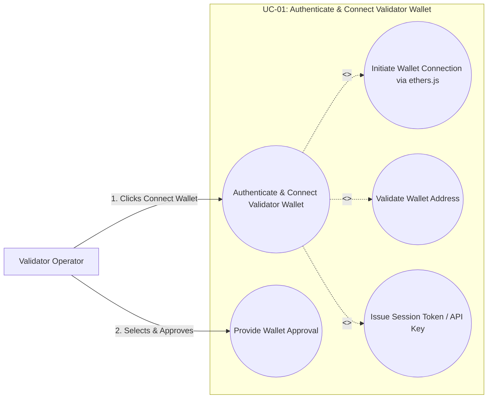
```mermaid
flowchart LR

%% Actor
Operator[Validator Operator]

%% System Boundary
subgraph UC01["UC-01: Authenticate & Connect Validator Wallet"]

    UC01_Main(("Authenticate & Connect Validator Wallet"))
    UC01_Step1(("Initiate Wallet Connection via ethers.js"))
    UC01_Step2(("Provide Wallet Approval"))
    UC01_Step3(("Validate Wallet Address"))
    UC01_Step4(("Issue Session Token / API Key"))

end

%% Actor Connections
Operator -->|"1. Clicks Connect Wallet"| UC01_Main
Operator -->|"2. Selects & Approves"| UC01_Step2

%% Include Relationships
UC01_Main -. "<<include>>" .-> UC01_Step1
UC01_Main -. "<<include>>" .-> UC01_Step3
UC01_Main -. "<<include>>" .-> UC01_Step4
```

**Table 3.2: Use Case Scenario: Automate Validator Node Setup**

| Use Case ID | UC-02 |
| :--- | :--- |
| **Use Case Name** | **Automate Validator Node Setup** |
| **Description** | Automates the end-to-end deployment, configuration, and initialization of a QIE Network V3 validator node. |
| **Primary Actor** | Validator Operator |
| **Secondary Actor** | QIE Network, QIE Setup Manager |
| **Pre-Condition** | Host machine meets minimum hardware requirements (CPU, RAM, Disk) and has internet access. |
| **Post-Condition** | Validator node is fully configured, synced with the QIE network, and actively participating in consensus. |
| **Basic Flow** | **Actor Action:** 1. User triggers the setup orchestration script via CLI. 2. User provides configuration parameters (moniker, chain-id). **System Action:** 1. System validates hardware requirements and downloads the binary. 2. System initializes the node, configures (ports, peers), and applies genesis data. 3. System starts the node process and reports successful sync status to the user. |

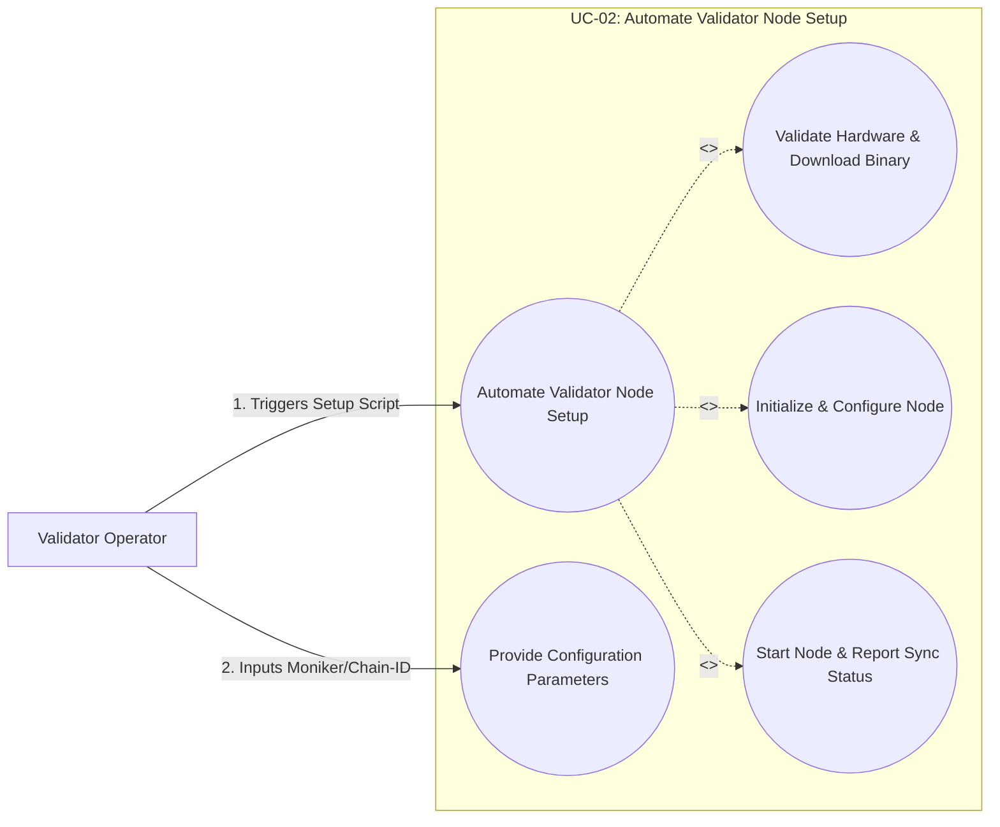
```mermaid
flowchart LR

%% Actor
Operator[Validator Operator]

%% System Boundary
subgraph UC02["UC-02: Automate Validator Node Setup"]

    UC02_Main(("Automate Validator Node Setup"))
    UC02_Step1(("Provide Configuration Parameters"))
    UC02_Step2(("Validate Hardware & Download Binary"))
    UC02_Step3(("Initialize & Configure Node"))
    UC02_Step4(("Start Node & Report Sync Status"))

end

%% Actor Connections
Operator -->|"1. Triggers Setup Script"| UC02_Main
Operator -->|"2. Inputs Moniker/Chain-ID"| UC02_Step1

%% Include Relationships
UC02_Main -. "<<include>>" .-> UC02_Step2
UC02_Main -. "<<include>>" .-> UC02_Step3
UC02_Main -. "<<include>>" .-> UC02_Step4
```
**Table 3.3: Use Case Scenario: Ingest & Analyze Cross-Chain Transactions**

| Use Case ID | UC-03 |
| :--- | :--- |
| **Use Case Name** | **Ingest & Analyze Cross-Chain Transactions** |
| **Description** | Continuously ingests live transactions from the QIE network, normalizes the data, and executes the unsupervised ML pipeline to assign a dynamic risk score. |
| **Primary Actor** | Al Intelligence Core |
| **Secondary Actor** | QIE Blockchain (RPC), PostgreSQL Database |
| **Pre-Condition** | The backend server is running, the RPC connection is active, and the ML model is loaded with established baselines. |
| **Post-Condition** | Transaction is persisted in the database with an assigned risk score (0-100) and anomaly reasoning. |
| **Basic Flow** | **Actor Action:** 1. (Automated) AI Core polls for new blocks/transactions. **System Action:** 1. System fetches raw transaction data via Tendermint RPC. 2. System normalizes the data and extracts features (volume, frequency, temporal patterns). 3. System feeds features into the Isolation Forest model to compute an anomaly score. 4. System saves the transaction and its risk score to the database. |

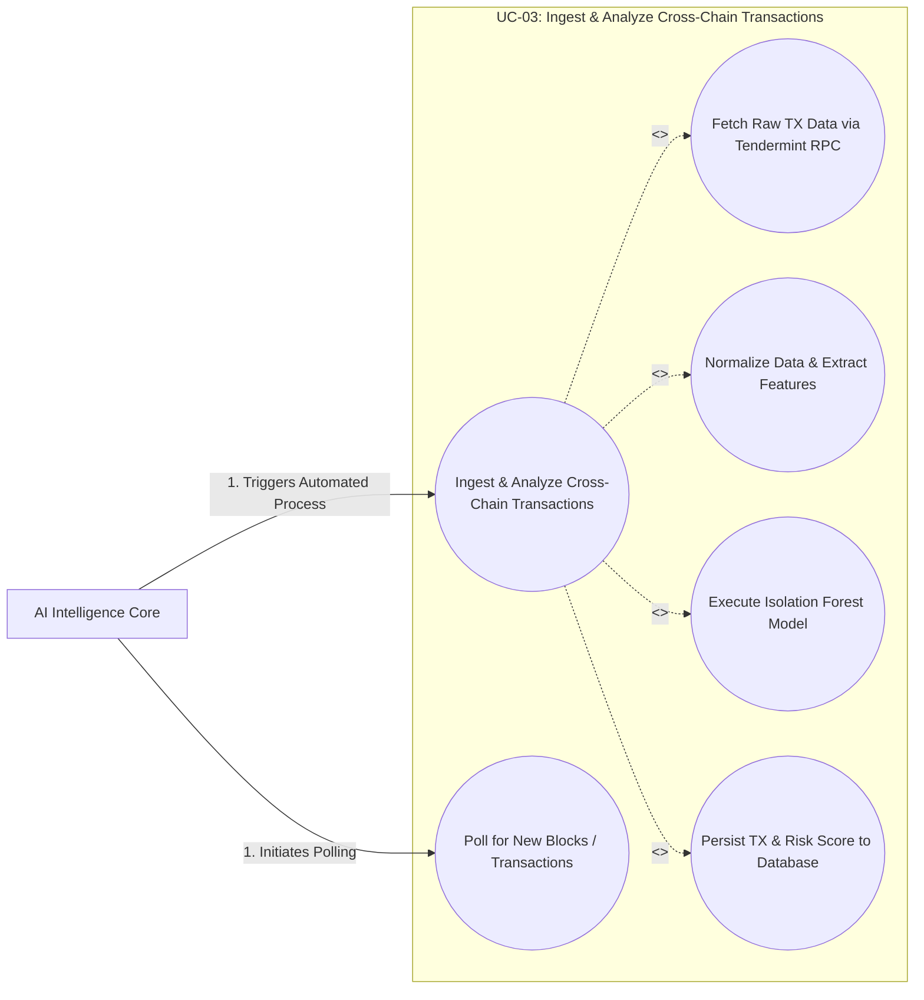
```mermaid
flowchart LR

%% Actor
AICore[AI Intelligence Core]

%% System Boundary
subgraph UC03["UC-03: Ingest & Analyze Cross-Chain Transactions"]

    UC03_Main(("Ingest & Analyze Cross-Chain Transactions"))
    UC03_Step1(("Poll for New Blocks / Transactions"))
    UC03_Step2(("Fetch Raw TX Data via Tendermint RPC"))
    UC03_Step3(("Normalize Data & Extract Features"))
    UC03_Step4(("Execute Isolation Forest Model"))
    UC03_Step5(("Persist TX & Risk Score to Database"))

end

%% Actor Connections
AICore -->|"1. Triggers Automated Process"| UC03_Main
AICore -->|"1. Initiates Polling"| UC03_Step1

%% Include Relationships
UC03_Main -. "<<include>>" .-> UC03_Step2
UC03_Main -. "<<include>>" .-> UC03_Step3
UC03_Main -. "<<include>>" .-> UC03_Step4
UC03_Main -. "<<include>>" .-> UC03_Step5
```

**Table 3.4: Use Case Scenario: Generate & Visualize Security Alerts**

| Use Case ID | UC-04 |
| :--- | :--- |
| **Use Case Name** | **Generate & Visualize Security Alerts** |
| **Description** | Evaluates computed risk scores against threshold parameters, generates structured alerts for anomalies, and pushes them to the unified dashboard. |
| **Primary Actor** | Validator Operator |
| **Secondary Actor** | Backend Server, AI Intelligence Core |
| **Pre-Condition** | Transactions have been processed and risk scores assigned (UC03 completed). |
| **Post-Condition** | High-risk anomalies are displayed on the dashboard with color-coded severity indicators, and historical logs are updated. |
| **Basic Flow** | **Actor Action:** 1. User views the real-time dashboard feed. 2. User identifies a color-coded (red/critical) alert. **System Action:** 1. System checks if the computed risk score breaches Critical/High thresholds. 2. System generates an alert object containing severity, reasoning, and transaction hash. 3. System pushes the alert to the Next.js frontend via API/WebSocket for immediate visualization.

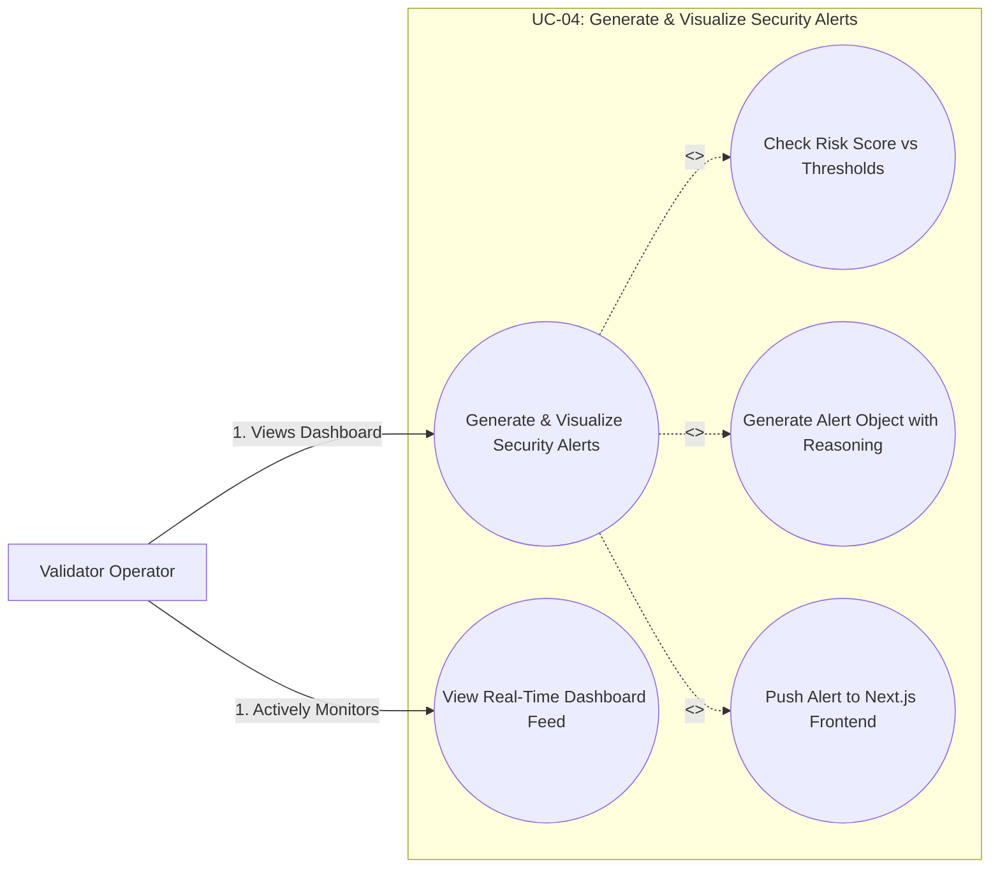
```mermaid
flowchart LR

%% Actor
Operator[Validator Operator]

%% System Boundary
subgraph UC04["UC-04: Generate & Visualize Security Alerts"]

    UC04_Main(("Generate & Visualize Security Alerts"))
    UC04_Step1(("View Real-Time Dashboard Feed"))
    UC04_Step2(("Check Risk Score vs Thresholds"))
    UC04_Step3(("Generate Alert Object with Reasoning"))
    UC04_Step4(("Push Alert to Next.js Frontend"))

end

%% Actor Connections
Operator -->|"1. Views Dashboard"| UC04_Main
Operator -->|"1. Actively Monitors"| UC04_Step1

%% Include Relationships
UC04_Main -. "<<include>>" .-> UC04_Step2
UC04_Main -. "<<include>>" .-> UC04_Step3
UC04_Main -. "<<include>>" .-> UC04_Step4
```
**Table 3.5: Use Case Scenario: Review Historical Alerts**

| Use Case ID | UC-05 |
| :--- | :--- |
| **Use Case Name** | **Review Historical Alerts** |
| **Description** | The operator queries the system for past security alerts and the AI reasoning behind them. |
| **Primary Actor** | Validator Operator |
| **Secondary Actor** | Al Intelligence Core |
| **Pre-Condition** | Historical alert data exists in the database. |
| **Post-Condition** | The operator views the historical anomaly data. |
| **Basic Flow** | **Actor Action:** 1. The operator requests historical alerts, optionally filtering by severity or date. **System Action:** 1. The frontend sends a request to the Flask API. 2. The API queries the database for matching alert records. 3. The system returns the alerts, including the associated transaction and anomaly reasoning. 4. The frontend displays the historical data to the operator. |

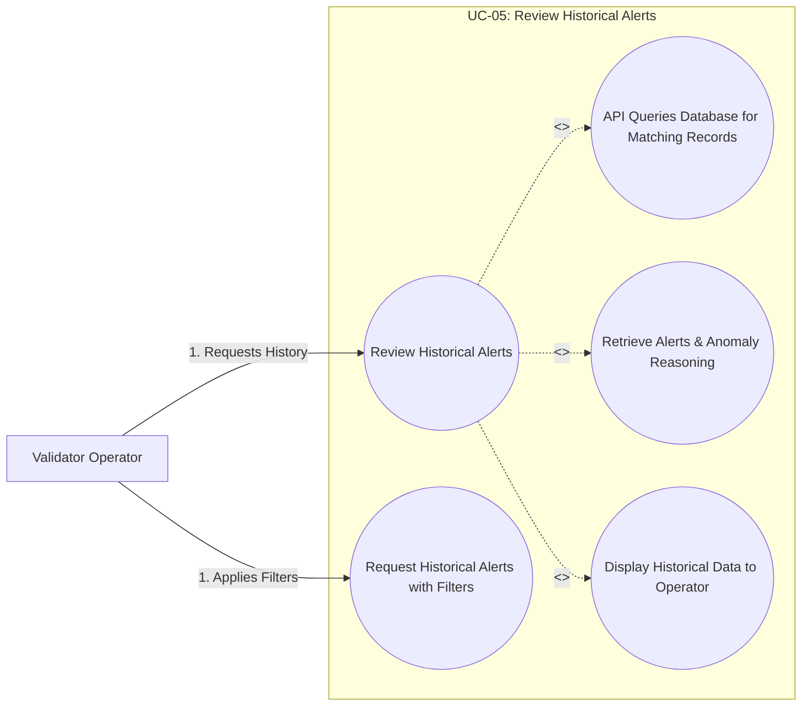
```mermaid
flowchart LR

%% Actor
Operator[Validator Operator]

%% System Boundary
subgraph UC05["UC-05: Review Historical Alerts"]

    UC05_Main(("Review Historical Alerts"))
    UC05_Step1(("Request Historical Alerts with Filters"))
    UC05_Step2(("API Queries Database for Matching Records"))
    UC05_Step3(("Retrieve Alerts & Anomaly Reasoning"))
    UC05_Step4(("Display Historical Data to Operator"))

end

%% Actor Connections
Operator -->|"1. Requests History"| UC05_Main
Operator -->|"1. Applies Filters"| UC05_Step1

%% Include Relationships
UC05_Main -. "<<include>>" .-> UC05_Step2
UC05_Main -. "<<include>>" .-> UC05_Step3
UC05_Main -. "<<include>>" .-> UC05_Step4
```

---

## Chapter 4: Design

### 4.1 Architecture Diagram
ValiGuard AI employs a layered, multi-tier architecture designed to ensure modularity, scalability, and clear separation of concerns. The system is decomposed into six distinct layers, each responsible for a specific domain of the application logic. This design ensures that the machine learning pipeline (AI Intelligence Core) can be upgraded independently of the data ingestion layer or the frontend presentation layer.

**Architectural Layers:**
1.  **External Source Layer:** Represents the QIE Blockchain network. The system interacts with this layer strictly through Tendermint RPC interfaces to read mempool data, block states, and node health.
2.  **Ingestion and Orchestration Layer:** The operational bridge between the blockchain and the application. It handles the automated setup of validator nodes and the continuous polling of transaction data.
3.  **Al Intelligence Core:** The analytical engine of the system. It receives normalized transaction data, extracts temporal and volumetric features, and executes unsupervised machine learning algorithms to compute risk scores.
4.  **Application and API Layer:** The central gateway built on Python/Flask. It manages business logic, handles REST API requests, orchestrates database transactions via SQLAlchemy, and pushes real-time alerts.
5.  **Presentation Layer:** The client-facing interface built with Next.js and React. It consumes the API layer to render the unified dashboard, visualizing node metrics and color-coded security alerts.
6.  **Data Persistence Layer:** The structural storage foundation of the system. Utilizing SQLAlchemy as the ORM and PostgreSQL as the primary relational database (with SQLite for development), this layer persists all normalized transactions, computed anomaly scores, generated alerts, and validator state. It ensures data durability for real-time querying, historical auditing, and future ML model retraining.

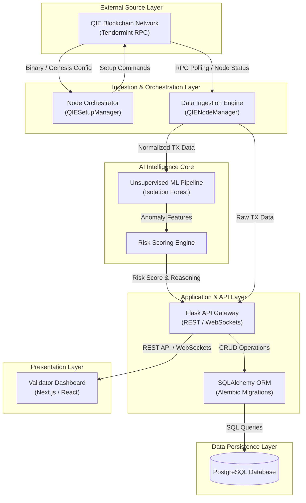
```mermaid
flowchart TB

%% ==========================
%% External Source Layer
%% ==========================
subgraph L1["External Source Layer"]
    QIE_NET["QIE Blockchain Network<br/>(Tendermint RPC)"]
end

%% ==========================
%% Ingestion & Orchestration Layer
%% ==========================
subgraph L2["Ingestion & Orchestration Layer"]
    ORCH["Node Orchestrator<br/>(QIESetupManager)"]
    INGEST["Data Ingestion Engine<br/>(QIENodeManager)"]
end

%% ==========================
%% AI Intelligence Core
%% ==========================
subgraph L3["AI Intelligence Core"]
    ML["Unsupervised ML Pipeline<br/>(Isolation Forest)"]
    SCORE["Risk Scoring Engine"]
end

%% ==========================
%% Application & API Layer
%% ==========================
subgraph L4["Application & API Layer"]
    FLASK["Flask API Gateway<br/>(REST / WebSockets)"]
    ORM["SQLAlchemy ORM<br/>(Alembic Migrations)"]
end

%% ==========================
%% Presentation Layer
%% ==========================
subgraph L5["Presentation Layer"]
    DASH["Validator Dashboard<br/>(Next.js / React)"]
end

%% ==========================
%% Data Persistence Layer
%% ==========================
subgraph L6["Data Persistence Layer"]
    DB[(PostgreSQL Database)]
end

%% ==========================
%% Data Flow & Dependencies
%% ==========================
QIE_NET -->|RPC Polling / Node Status| INGEST
QIE_NET -->|Binary / Genesis Config| ORCH

INGEST -->|Normalized TX Data| ML
ML -->|Anomaly Features| SCORE

SCORE -->|Risk Score & Reasoning| FLASK
INGEST -->|Raw TX Data| FLASK
ORCH -->|Setup Commands| QIE_NET

FLASK -->|CRUD Operations| ORM
ORM -->|SQL Queries| DB

FLASK -->|REST API / WebSockets| DASH
```
### 4.2 ERD with Data Dictionary
The relational database schema is designed to capture the lifecycle of a cross-chain transaction, from initial ingestion through AI analysis to final alert generation. The schema adheres to third normal form (3NF) to minimize data redundancy and ensure referential integrity.

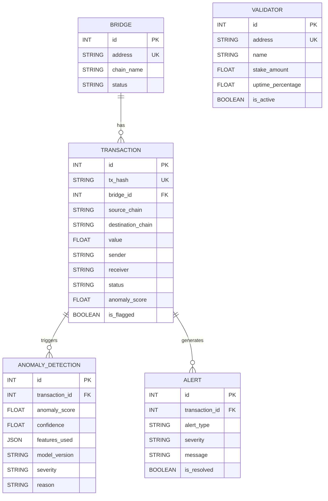
```mermaid
erDiagram

    BRIDGE {
        INT id PK
        STRING address UK
        STRING chain_name
        STRING status
    }

    TRANSACTION {
        INT id PK
        STRING tx_hash UK
        INT bridge_id FK
        STRING source_chain
        STRING destination_chain
        FLOAT value
        STRING sender
        STRING receiver
        STRING status
        FLOAT anomaly_score
        BOOLEAN is_flagged
    }

    ANOMALY_DETECTION {
        INT id PK
        INT transaction_id FK
        FLOAT anomaly_score
        FLOAT confidence
        JSON features_used
        STRING model_version
        STRING severity
        STRING reason
    }

    ALERT {
        INT id PK
        INT transaction_id FK
        STRING alert_type
        STRING severity
        STRING message
        BOOLEAN is_resolved
    }

    VALIDATOR {
        INT id PK
        STRING address UK
        STRING name
        FLOAT stake_amount
        FLOAT uptime_percentage
        BOOLEAN is_active
    }

    BRIDGE ||--o{ TRANSACTION : has
    TRANSACTION ||--o{ ANOMALY_DETECTION : triggers
    TRANSACTION ||--o{ ALERT : generates
```

**Data Dictionary**
The following data dictionary defines the structural attributes, data types, and constraints for each entity in the ValiGuard AI database.

**Table 4.1: Data Dictionary: Bridges**

| Attribute | Data Type | Constraints | Description |
| :--- | :--- | :--- | :--- |
| **id** | Integer | Primary Key, Auto-increment | Unique identifier for the bridge record. |
| **address** | String(255) | Unique, Not Null, Indexed | The smart contract address of the cross-chain bridge. |
| **chain_name** | String(50) | Not Null | The source blockchain identifier (e.g., QIE, Ethereum). |
| **status** | Enum | Not Null, Default: ACTIVE | Current operational status (ACTIVE, PAUSED, INACTIVE). |
| **created_at** | DateTime | Not Null, Indexed | Timestamp of when the bridge was first monitored. |
| **last_verified_at** | DateTime | Nullable | Timestamp of the most recent health verification. |

**Table 4.2: Data Dictionary: transactions**

| Attribute | Data Type | Constraints | Description |
| :--- | :--- | :--- | :--- |
| **id** | Integer | Primary Key, Auto-increment | Unique identifier for the transaction record. |
| **tx_hash** | String(255) | Unique, Not Null, Indexed | Cryptographic hash of the transaction. |
| **bridge_id** | Integer | Foreign Key (bridges.id), Indexed | Reference to the associated bridge. |
| **source_chain** | String(50) | Not Null | The originating blockchain network. |
| **destination_chain** | String(50) | Not Null | The destination blockchain network. |
| **value** | Float | Not Null | The token amount transferred across the bridge. |
| **sender** | String(255) | Not Null | The wallet address initiating the transfer. |
| **receiver** | String(255) | Not Null | The destination wallet address. |
| **status** | Enum | Not Null, Default: PENDING | Lifecycle state (PENDING, CONFIRMED, FAILED). |
| **anomaly_score** | Float | Default: 0.0 | ML-computed risk probability from 0.0 to 100.0. |
| **is_flagged** | Boolean | Indexed, Default: False | True if the anomaly_score breaches safety thresholds. |

**Table 4.3: Data Dictionary: anomaly_detections**

| Attribute | Data Type | Constraints | Description |
| :--- | :--- | :--- | :--- |
| **id** | Integer | Primary Key, Auto-increment | Unique identifier for the inference record. |
| **transaction_id** | Integer | Foreign Key (transactions.id), Indexed | The specific transaction evaluated by the model. |
| **anomaly_score** | Float | Not Null | The raw risk score output by the isolation forest model. |
| **confidence** | Float | Not Null | The statistical confidence interval of the prediction. |
| **features_used** | JSON | Nullable | Serialized array of variables that influenced the model. |
| **severity** | Enum | Not Null, Indexed | Categorized risk (LOW, MEDIUM, HIGH, CRITICAL). |
| **reason** | String(500) | Nullable | Human-readable explanation of the flagged behavior. |

**Table 4.4: Data Dictionary: alerts**

| Attribute | Data Type | Constraints | Description |
| :--- | :--- | :--- | :--- |
| **id** | Integer | Primary Key, Auto-increment | Unique identifier for the alert instance. |
| **transaction_id** | Integer | Foreign Key (transactions.id), Indexed | The transaction triggering the alert notification. |
| **alert_type** | Enum | Not Null, Indexed | Classification of alert (ANOMALY, TIMEOUT, ERROR). |
| **severity** | Enum | Not Null, Indexed | Priority level (INFO, WARNING, ERROR, CRITICAL). |
| **message** | String(500) | Not Null | Detailed alert notification string sent to the dashboard. |
| **is_resolved** | Boolean | Indexed, Default: False | Status flag indicating if the operator has addressed it. |

**Table 4.5: Data Dictionary: validators**

| Attribute | Data Type | Constraints | Description |
| :--- | :--- | :--- | :--- |
| **id** | Integer | Primary Key, Auto-increment | Unique identifier for the validator record. |
| **address** | String(255) | Unique, Not Null, Indexed | The public operator address of the QIE validator. |
| **name** | String(255) | Not Null | The configured moniker for the validator node. |
| **stake_amount** | Float | Not Null, Default: 0.0 | The volume of capital bonded to the validator. |
| **uptime_percentage** | Float | Not Null, Default: 100.0 | Moving average of the node's block proposal participation. |
| **is_active** | Boolean | Indexed, Default: True | Network consensus participation status. |

### 4.3 Data Flow Diagram
Data Flow Diagrams (DFDs) illustrate how data moves through the ValiGuard Al system, detailing the processes that transform the data and the stores that hold it. The system is decomposed into two levels of abstraction.

#### 4.3.1 The Level 0 (Context Diagram)
The Level 0 DFD provides the highest-level view of the system, treating ValiGuard AI as a single process interacting with external entities.

**External Entities:**
*   **Validator Operator:** The human user who configures the system and consumes the dashboard analytics.
*   **QIE Blockchain:** The external network providing raw blockchain data and receiving orchestration commands.

**Core Process:**
*   **0: ValiGuard AI System:** The entirety of the application logic, from ingestion to visualization.

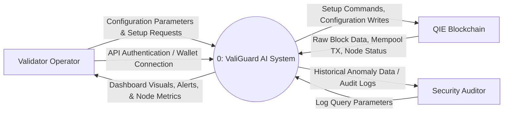
```mermaid
flowchart LR

%% External Entities
VO["Validator Operator"]
BC["QIE Blockchain"]
SA["Security Auditor"]

%% Main Process
VG(("0: ValiGuard AI System"))

%% Data Flows
VO -->|"Configuration Parameters & Setup Requests"| VG
VO -->|"API Authentication / Wallet Connection"| VG

VG -->|"Dashboard Visuals, Alerts, & Node Metrics"| VO

BC -->|"Raw Block Data, Mempool TX, Node Status"| VG
VG -->|"Setup Commands, Configuration Writes"| BC

VG -->|"Historical Anomaly Data / Audit Logs"| SA
SA -->|"Log Query Parameters"| VG
```

#### 4.3.2 The Level 1
The Level 1 DFD decomposes the central system into its major sub-processes, revealing how data flows between internal modules and the PostgreSQL database.

**Processes:**
*   **1.0 Node Orchestration:** Manages the setup and configuration of the validator node.
*   **2.0 Transaction Ingestion:** Polls the blockchain and normalizes incoming data.
*   **3.0 Anomaly Detection (AI Core):** Executes ML inference on normalized transactions.
*   **4.0 Dashboard & Alerting:** Formats data for the frontend and triggers security alerts.

**Data Stores:**
*   **D1: PostgreSQL Database:** Persistent storage for transactions, anomalies, and alerts.

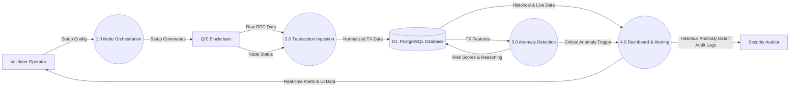
```mermaid
flowchart LR

%% External Entities
VO["Validator Operator"]
SA["Security Auditor"]
BC["QIE Blockchain"]

%% Processes
P1(("1.0 Node Orchestration"))
P2(("2.0 Transaction Ingestion"))
P3(("3.0 Anomaly Detection"))
P4(("4.0 Dashboard & Alerting"))

%% Data Store
DB[(D1: PostgreSQL Database)]

%% Data Flows
VO -->|"Setup Config"| P1

P1 -->|"Setup Commands"| BC

BC -->|"Raw RPC Data"| P2
BC -->|"Node Status"| P2

P2 -->|"Normalized TX Data"| DB

DB -->|"TX Features"| P3
P3 -->|"Risk Scores & Reasoning"| DB

DB -->|"Historical & Live Data"| P4
P3 -->|"Critical Anomaly Trigger"| P4

P4 -->|"Real-time Alerts & UI Data"| VO
P4 -->|"Historical Anomaly Data / Audit Logs"| SA
```

### 4.4 Class Diagram
The Class Diagram models the static structure of the ValiGuard Al backend, specifically detailing the SQLAlchemy ORM models and their relationships, alongside the primary manager classes that handle system logic.

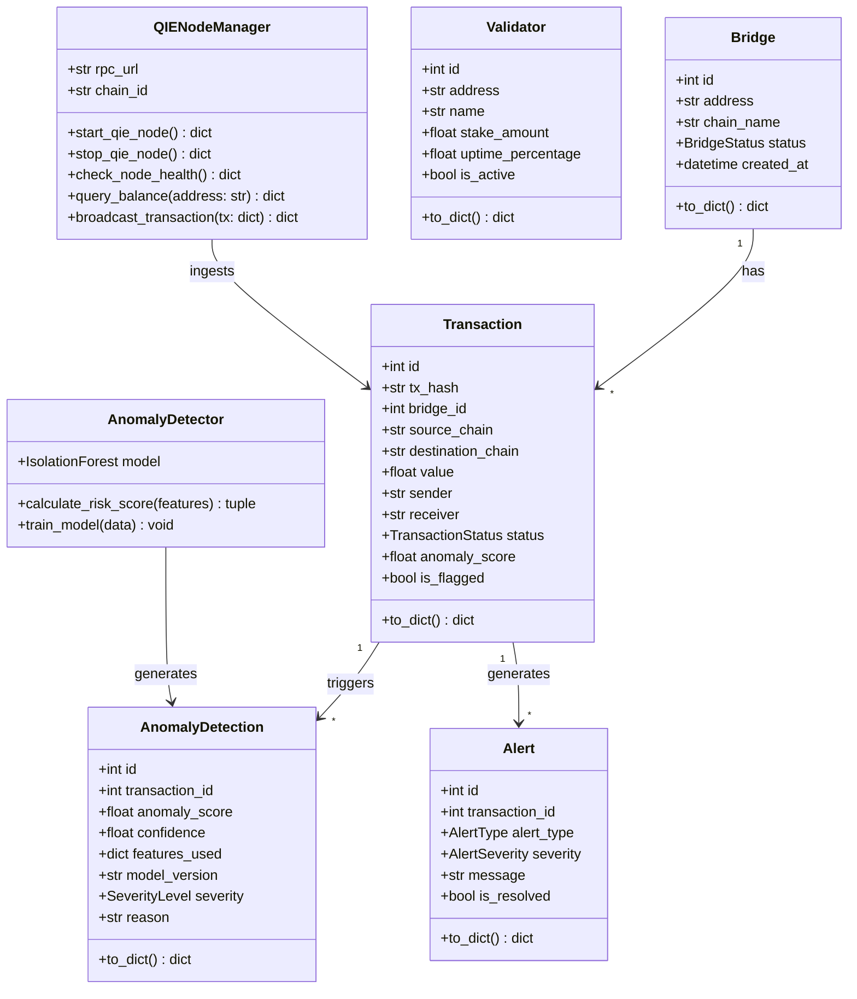
```mermaid
classDiagram

class QIENodeManager {
    +str rpc_url
    +str chain_id

    +start_qie_node() dict
    +stop_qie_node() dict
    +check_node_health() dict
    +query_balance(address: str) dict
    +broadcast_transaction(tx: dict) dict
}

class Validator {
    +int id
    +str address
    +str name
    +float stake_amount
    +float uptime_percentage
    +bool is_active

    +to_dict() dict
}

class Bridge {
    +int id
    +str address
    +str chain_name
    +BridgeStatus status
    +datetime created_at

    +to_dict() dict
}

class Transaction {
    +int id
    +str tx_hash
    +int bridge_id
    +str source_chain
    +str destination_chain
    +float value
    +str sender
    +str receiver
    +TransactionStatus status
    +float anomaly_score
    +bool is_flagged

    +to_dict() dict
}

class AnomalyDetector {
    +IsolationForest model

    +calculate_risk_score(features) tuple
    +train_model(data) void
}

class AnomalyDetection {
    +int id
    +int transaction_id
    +float anomaly_score
    +float confidence
    +dict features_used
    +str model_version
    +SeverityLevel severity
    +str reason

    +to_dict() dict
}

class Alert {
    +int id
    +int transaction_id
    +AlertType alert_type
    +AlertSeverity severity
    +str message
    +bool is_resolved

    +to_dict() dict
}

Bridge "1" --> "*" Transaction : has

Transaction "1" --> "*" AnomalyDetection : triggers

Transaction "1" --> "*" Alert : generates

QIENodeManager --> Transaction : ingests

AnomalyDetector --> AnomalyDetection : generates
```

### 4.5 Activity Diagram
This Activity Diagram details the step-by-step workflow of the core anomaly detection pipeline; from the moment a new transaction is observed on the network to the generation of a security alert on the dashboard.

#### 4.5.1 Activity Diagram: Automated Validator Node Orchestration
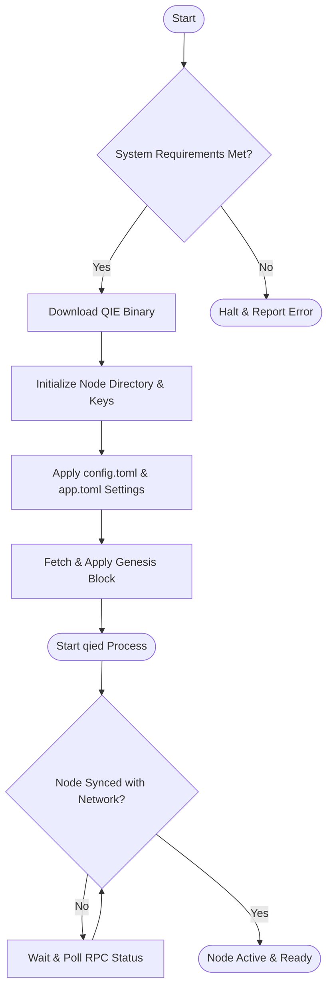
```mermaid
flowchart TD

Start([Start])

A{System Requirements Met?}

B[Download QIE Binary]
C[Initialize Node Directory & Keys]
D[Apply config.toml & app.toml Settings]
E[Fetch & Apply Genesis Block]

F([Start qied Process])

G{Node Synced with Network?}

H[Wait & Poll RPC Status]

Success([Node Active & Ready])
Error([Halt & Report Error])

Start --> A

A -- Yes --> B
A -- No --> Error

B --> C
C --> D
D --> E
E --> F

F --> G

G -- No --> H
H --> G

G -- Yes --> Success
```

#### 4.5.2 Activity Diagram: Real-Time Transaction Anomaly Detection
This diagram details the core intelligence pipeline of ValiGuard AI, representing the transition from raw blockchain data to actionable risk assessment. It visualizes how the QIENodeManager ingests unstructured transaction data via RPC, normalizes it, and persists it to the database. The flow then transitions to the AI Intelligence Core, where multivariate features (volume, frequency, temporal patterns) are extracted and evaluated by the Isolation Forest algorithm. The decision node is pivotal, representing the exact moment unsupervised machine learning distinguishes between standard network noise and a statistically significant anomaly, thereby triggering the flagging mechanism.

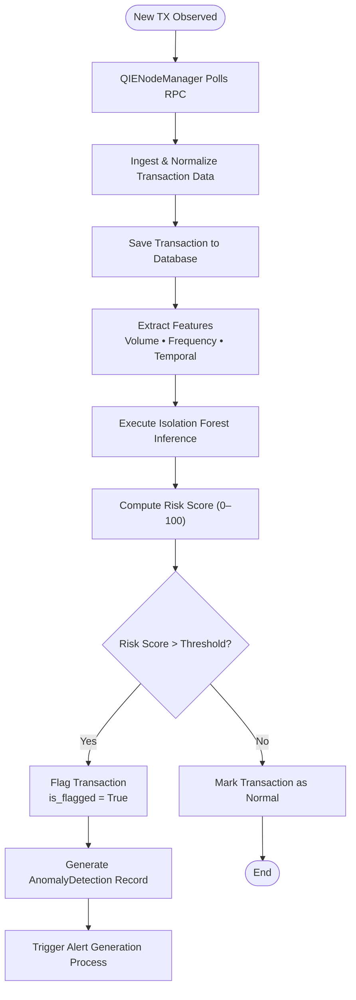
```mermaid
flowchart TD

Start([New TX Observed])

A[QIENodeManager Polls RPC]

B[Ingest & Normalize Transaction Data]

C[Save Transaction to Database]

D[Extract Features<br/>Volume • Frequency • Temporal]

E[Execute Isolation Forest Inference]

F["Compute Risk Score (0–100)"]

G{Risk Score > Threshold?}

H[Mark Transaction as Normal]

I[Flag Transaction<br/>is_flagged = True]

J[Generate AnomalyDetection Record]

K[Trigger Alert Generation Process]

End([End])

Start --> A
A --> B
B --> C
C --> D
D --> E
E --> F
F --> G

G -- No --> H
H --> End

G -- Yes --> I
I --> J
J --> K
```

#### 4.5.3 Activity Diagram: Alert Generation and Dashboard Visualization
This activity diagram captures the lifecycle of a security alert once an anomaly is detected. It demonstrates the bridge between backend ML inference and frontend user experience. The flow begins immediately after a risk threshold breach, showing how the system maps the numerical anomaly score to a categorized severity level (Critical, High, Medium, Low). It details the persistence of the alert in the PostgreSQL database and the subsequent propagation of the alert payload via WebSocket/REST API to the Next.js frontend. Finally, it illustrates the human-in-the-loop resolution process, where the validator operator reviews the visual alert and formally closes the loop by updating the database record.

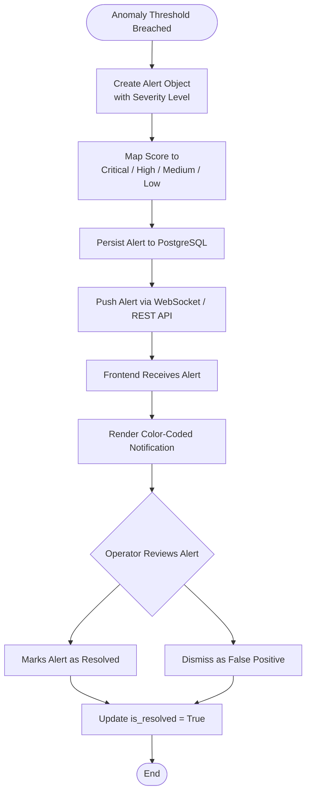
```mermaid
flowchart TD

Start([Anomaly Threshold Breached])

A[Create Alert Object<br/>with Severity Level]

B[Map Score to<br/>Critical / High / Medium / Low]

C[Persist Alert to PostgreSQL]

D[Push Alert via WebSocket / REST API]

E[Frontend Receives Alert]

F[Render Color-Coded Notification]

G{Operator Reviews Alert}

H[Marks Alert as Resolved]

I[Dismiss as False Positive]

J[Update is_resolved = True]

End([End])

Start --> A
A --> B
B --> C
C --> D
D --> E
E --> F
F --> G

G --> H
G --> I

H --> J
I --> J

J --> End
```

#### 4.5.4 Activity Diagram: Web3 Wallet Authentication
This diagram outlines the secure authentication workflow designed for the validator dashboard. Moving away from traditional email and password combinations, the system leverages Web3 cryptographic signatures for identity verification. The flow demonstrates the interaction between the frontend application, the operator's browser wallet extension (e.g., MetaMask), and the backend validation logic. It highlights the branching logic where a user's denial of the connection request gracefully reverts the dashboard to an unauthenticated state, whereas a successful signature validation results in the issuance of a session token, granting access to secure telemetry endpoints.

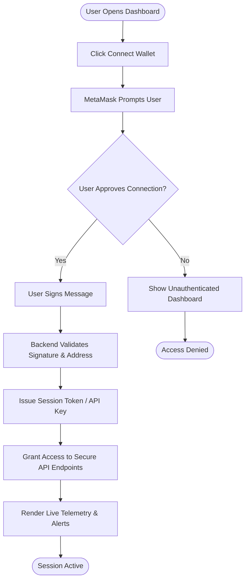
```mermaid
flowchart TD

Start([User Opens Dashboard])

A[Click Connect Wallet]

B[MetaMask Prompts User]

C{User Approves Connection?}

D[Show Unauthenticated Dashboard]

E[User Signs Message]

F[Backend Validates Signature & Address]

G[Issue Session Token / API Key]

H[Grant Access to Secure API Endpoints]

I[Render Live Telemetry & Alerts]

Session([Session Active])

Denied([Access Denied])

Start --> A
A --> B
B --> C

C -- No --> D
D --> Denied

C -- Yes --> E
E --> F
F --> G
G --> H
H --> I
I --> Session
```

### 4.6 Sequence Diagrams
Sequence diagrams model the time-ordered interaction between system components, illustrating how objects collaborate to fulfill specific use cases.

#### 4.6.1 Sequence Diagram: Real-Time Anomaly Detection and Alerting
This sequence diagram illustrates the core intelligence pipeline of ValiGuard AI. It captures the chronological message flow from the moment the backend ingests a raw transaction from the QIE network to the point a security alert is rendered on the validator dashboard. It highlights the asynchronous nature of the ML inference and the decoupled communication between the Al Intelligence Core and the Presentation Layer via the database and REST API.

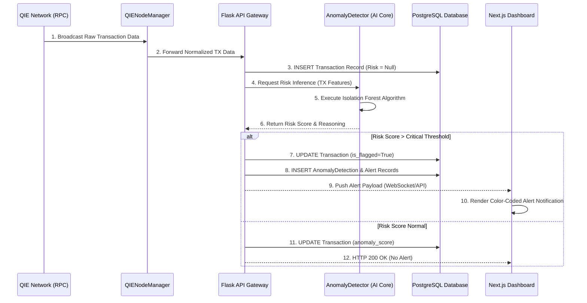
```mermaid
sequenceDiagram
    participant RPC as QIE Network (RPC)
    participant Node as QIENodeManager
    participant API as Flask API Gateway
    participant AI as AnomalyDetector (AI Core)
    participant DB as PostgreSQL Database
    participant UI as Next.js Dashboard

    RPC->>Node: 1. Broadcast Raw Transaction Data
    Node->>API: 2. Forward Normalized TX Data
    API->>DB: 3. INSERT Transaction Record (Risk = Null)

    API->>AI: 4. Request Risk Inference (TX Features)
    AI->>AI: 5. Execute Isolation Forest Algorithm
    AI-->>API: 6. Return Risk Score & Reasoning

    alt Risk Score > Critical Threshold
        API->>DB: 7. UPDATE Transaction (is_flagged=True)
        API->>DB: 8. INSERT AnomalyDetection & Alert Records
        API-->>UI: 9. Push Alert Payload (WebSocket/API)
        UI->>UI: 10. Render Color-Coded Alert Notification
    else Risk Score Normal
        API->>DB: 11. UPDATE Transaction (anomaly_score)
        API-->>UI: 12. HTTP 200 OK (No Alert)
    end
```

#### 4.6.2 Sequence Diagram: Automated Node Setup and Synchronization
This diagram details the orchestration sequence required to bring a validator node from an uninitialized state to an active, synchronized participant on the QIE network. It demonstrates the interaction between the operator, the orchestration scripts, the local file system (for configuration), and the QIE network binary.

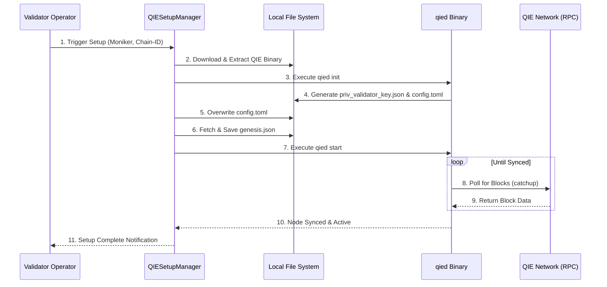
```mermaid
sequenceDiagram
    participant Operator as Validator Operator
    participant Setup as QIESetupManager
    participant FS as Local File System
    participant Node as qied Binary
    participant RPC as QIE Network (RPC)

    Operator->>Setup: 1. Trigger Setup (Moniker, Chain-ID)

    Setup->>FS: 2. Download & Extract QIE Binary

    Setup->>Node: 3. Execute qied init

    Node->>FS: 4. Generate priv_validator_key.json & config.toml

    Setup->>FS: 5. Overwrite config.toml
    Setup->>FS: 6. Fetch & Save genesis.json

    Setup->>Node: 7. Execute qied start

    loop Until Synced
        Node->>RPC: 8. Poll for Blocks (catchup)
        RPC-->>Node: 9. Return Block Data
    end

    Node-->>Setup: 10. Node Synced & Active
    Setup-->>Operator: 11. Setup Complete Notification
```

#### 4.6.3 Sequence Diagram: Web3 Wallet Authentication
This diagram models the cryptographic authentication flow. It shows how the Next.js frontend initiates a connection, how the user interacts with their off-chain Web3 wallet extension, and how the backend validates the cryptographic signature to establish a secure session without relying on traditional password databases.

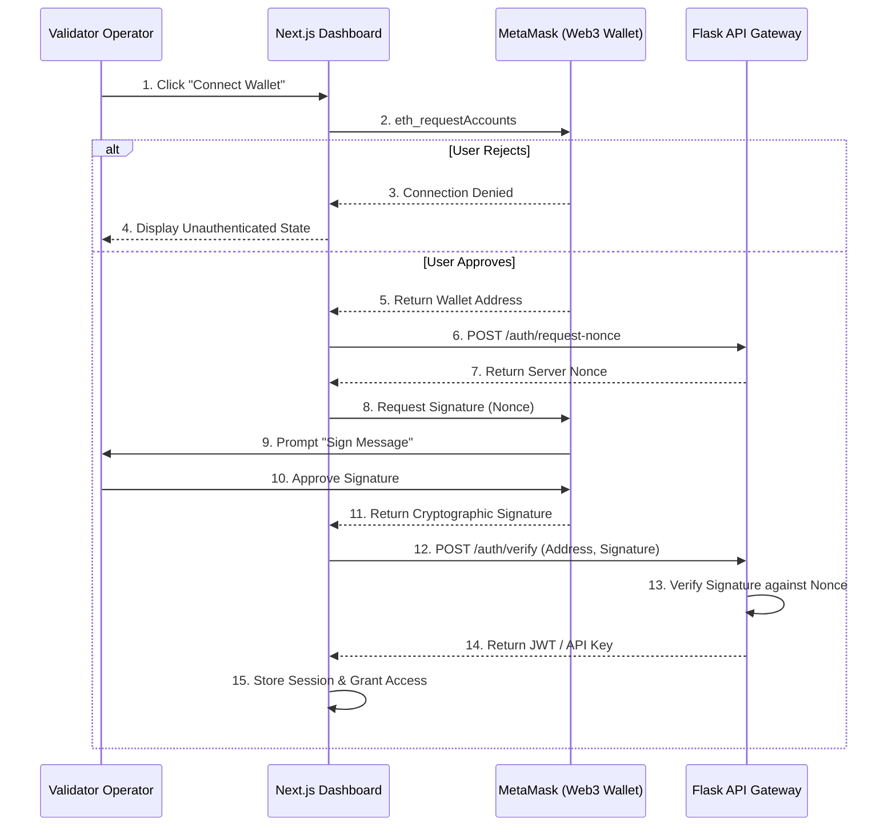
```mermaid
sequenceDiagram
    participant User as Validator Operator
    participant UI as Next.js Dashboard
    participant Wallet as MetaMask (Web3 Wallet)
    participant API as Flask API Gateway

    User->>UI: 1. Click "Connect Wallet"
    UI->>Wallet: 2. eth_requestAccounts

    alt User Rejects
        Wallet-->>UI: 3. Connection Denied
        UI-->>User: 4. Display Unauthenticated State
    else User Approves
        Wallet-->>UI: 5. Return Wallet Address

        UI->>API: 6. POST /auth/request-nonce
        API-->>UI: 7. Return Server Nonce

        UI->>Wallet: 8. Request Signature (Nonce)
        Wallet->>User: 9. Prompt "Sign Message"
        User->>Wallet: 10. Approve Signature
        Wallet-->>UI: 11. Return Cryptographic Signature

        UI->>API: 12. POST /auth/verify (Address, Signature)
        API->>API: 13. Verify Signature against Nonce
        API-->>UI: 14. Return JWT / API Key

        UI->>UI: 15. Store Session & Grant Access
    end
```

### 4.7 Collaboration Diagrams
Collaboration diagrams (also known as Communication diagrams in UML 2.x) emphasize the structural organization of objects that send and receive messages, rather than the chronological order of the messages. They are ideal for visualizing the architectural dependencies and data pathways within ValiGuard AI.

#### 4.7.1 Collaboration Diagram: System Component Interaction
This collaboration diagram illustrates how the primary structural components of ValiGuard Al interact to achieve the system's goals. It highlights that the Flask API Gateway acts as the central hub, mediating data flow between the external blockchain, the internal Al engine, the persistent storage, and the user interface.

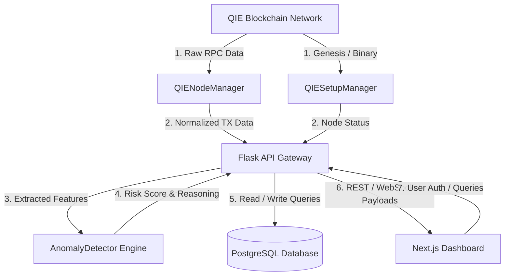
```mermaid
flowchart TD

Blockchain["QIE Blockchain Network"]

NodeMgr["QIENodeManager"]
Setup["QIESetupManager"]

Flask["Flask API Gateway"]

Anomaly["AnomalyDetector Engine"]

DB[(PostgreSQL Database)]

Dashboard["Next.js Dashboard"]

Blockchain -->|"1. Raw RPC Data"| NodeMgr
Blockchain -->|"1. Genesis / Binary"| Setup

NodeMgr -->|"2. Normalized TX Data"| Flask
Setup -->|"2. Node Status"| Flask

Flask -->|"3. Extracted Features"| Anomaly
Anomaly -->|"4. Risk Score & Reasoning"| Flask

Flask -->|"5. Read / Write Queries"| DB

Flask -->|"6. REST / WebSocket Payloads"| Dashboard
Dashboard -->|"7. User Auth / Queries"| Flask
```

#### 4.7.2 Collaboration Diagram: Al Intelligence Core Object Collaboration
This diagram zooms into the AI Intelligence Core, detailing the structural collaboration between the Python objects responsible for transforming raw transaction data into actionable security alerts. It illustrates how the AnomalyDetector relies on feature extraction from the Transaction model, utilizes the IsolationForest algorithm, and subsequently instantiates the AnomalyDetection and Alert models to persist the inference results.

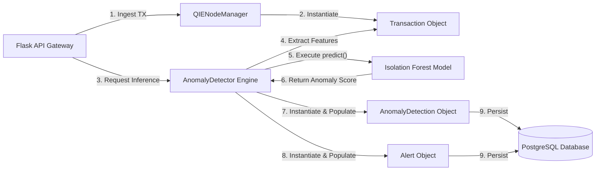
```mermaid
flowchart LR

Flask["Flask API Gateway"]

NodeMgr["QIENodeManager"]

TX["Transaction Object"]

Detector["AnomalyDetector Engine"]

Forest["Isolation Forest Model"]

Detection["AnomalyDetection Object"]

Alert["Alert Object"]

DB[(PostgreSQL Database)]

Flask -->|"1. Ingest TX"| NodeMgr

NodeMgr -->|"2. Instantiate"| TX

Flask -->|"3. Request Inference"| Detector

Detector -->|"4. Extract Features"| TX

Detector -->|"5. Execute predict()"| Forest

Forest -->|"6. Return Anomaly Score"| Detector

Detector -->|"7. Instantiate & Populate"| Detection

Detector -->|"8. Instantiate & Populate"| Alert

Detection -->|"9. Persist"| DB

Alert -->|"9. Persist"| DB
```

### 4.8 State Transition Diagrams
State Transition Diagrams model the dynamic behavior of entities within the system, illustrating the distinct states an object can occupy and the triggers that cause transitions between those states.

#### 4.8.1 The Transaction Lifecycle
This diagram illustrates the lifecycle of a cross-chain transaction from the moment it is ingested by the ValiGuard AI system. It reflects the states defined in the TransactionStatus enumeration (PENDING, CONFIRMED, FAILED, and NORMAL) and incorporates the Al-driven flagging mechanism. A critical adjustment in this diagram is the representation of the "Flagged" state; rather than altering the execution status of the blockchain transaction itself, the ML inference engine triggers a transition in the is_flagged boolean attribute if the computed anomaly score breaches operational thresholds, moving the transaction into a state requiring operator review.

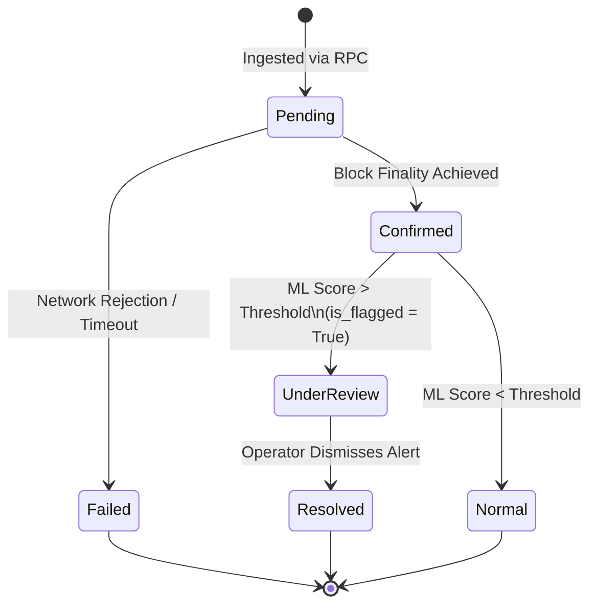
```mermaid
stateDiagram-v2

[*] --> Pending : Ingested via RPC

Pending --> Confirmed : Block Finality Achieved
Pending --> Failed : Network Rejection / Timeout

Confirmed --> UnderReview : ML Score > Threshold\n(is_flagged = True)
Confirmed --> Normal : ML Score < Threshold

UnderReview --> Resolved : Operator Dismisses Alert

Failed --> [*]
Resolved --> [*]
Normal --> [*]
```

#### 4.8.2 The Validator Node Lifecycle
This state diagram maps directly to the orchestration logic encapsulated within the QIESetupManager and QIENodeManager classes. It models the validator node's journey from an uninitialized system to an active participant in the QIE consensus. The diagram highlights the cyclical "Syncing" state, where the system continuously polls the Tendermint RPC (catching_up = true) until the local block height matches the network, triggering the transition to the "Active" state. It also accounts for error handling and graceful shutdown procedures.

```mermaid
stateDiagram-v2

[*] --> Uninitialized : Host Provisioned

Uninitialized --> Installed : QIESetupManager downloads binary

Installed --> Configured : config.toml & genesis.json applied

Configured --> Syncing : qied start executed

Syncing --> Syncing : Polling RPC\n(catching_up = True)

Syncing --> Active : catching_up = False

Active --> Syncing : Network Outage / Desync

Active --> Stopped : Graceful Shutdown (SIGTERM)

Stopped --> Syncing : Process Restarted

Stopped --> [*]

Configured --> Error : Binary Failure / Missing Genesis

Syncing --> Error : RPC Unreachable

Error --> Uninitialized : Reset Triggered\n(unsafe-reset-all)
```

### 4.9 Component Diagram
The Component Diagram models the high-level architectural building blocks of ValiGuard Al, illustrating how the software is decomposed into autonomous, replaceable modules. It defines the structural relationships and data dependencies between the major subsystems, ensuring adherence to the modularity requirement (NFR-09) so that the ML model can be swapped without altering the API or Dashboard layers.

```mermaid
flowchart LR

%% ==========================================
%% External Component
%% ==========================================

Blockchain["External: QIE Blockchain Network"]

%% ==========================================
%% Orchestration Engine
%% ==========================================

subgraph Orchestration["Orchestration Engine"]
    Setup["QIESetupManager"]
    NodeMgr["QIENodeManager"]
end

%% ==========================================
%% API Gateway
%% ==========================================

subgraph API["API Gateway"]
    Flask["Flask REST Endpoints"]
    Auth["API Key / JWT Auth"]
end

%% ==========================================
%% Validator Dashboard
%% ==========================================

subgraph Dashboard["Validator Dashboard"]
    NextUI["Next.js Application"]
    WSClient["WebSocket Client"]
end

%% ==========================================
%% AI Intelligence Core
%% ==========================================

subgraph AI["AI Intelligence Core"]
    FeatExt["Feature Extraction Module"]
    IsoForest["Isolation Forest Engine"]
end

%% ==========================================
%% Data Persistence
%% ==========================================

subgraph Data["Data Persistence"]
    ORM["SQLAlchemy / Alembic"]
    DB[(PostgreSQL)]
end

%% ==========================================
%% Dependencies
%% ==========================================

Blockchain -->|"Tendermint RPC / Genesis"| Setup
Blockchain -->|"Raw RPC TX Data"| NodeMgr

Setup -->|"Node Status API"| Flask
NodeMgr -->|"Normalized TX Data"| Flask

NextUI -->|"HTTP REST API"| Flask
WSClient -->|"WebSocket Subscribe"| Flask

Flask -. "Token Validation" .-> Auth

Flask -->|"Inference Request"| FeatExt
FeatExt -->|"Feature Vectors"| IsoForest
IsoForest -->|"Risk Score Callback"| Flask

Flask -->|"CRUD Operations"| ORM
ORM -->|"SQL Execution"| DB
```

### 4.10 Deployment Diagram
The Deployment Diagram illustrates the physical mapping of the ValiGuard AI software artifacts onto the hardware infrastructure. It demonstrates the two primary execution environments: the Validator Host Server (typically a Linux machine or WSL2 instance on Windows) that runs the backend infrastructure and the blockchain client, and the Client Device that runs the browser-based dashboard.

```mermaid
flowchart LR

%% ==========================================
%% Client Device
%% ==========================================

subgraph Client["Client Device (User Machine)"]

    subgraph Browser["Web Browser"]
        NextApp["📦 Next.js Dashboard Bundle"]
        MetaMask["📦 MetaMask Extension"]
    end

end

%% ==========================================
%% Validator Host Server
%% ==========================================

subgraph Server["Validator Host Server (Ubuntu / Linux)"]

    %% Python Environment
    subgraph PythonEnv["Python 3.x Virtual Environment"]
        Flask["📦 Flask API Server"]
        ML["📦 Scikit-learn Engine"]
        Scripts["📦 Orchestration Scripts"]
    end

    %% Database
    subgraph DBEnv["Database Container / Service"]
        Postgres[("PostgreSQL Server")]
    end

    %% Blockchain Runtime
    subgraph ChainEnv["Blockchain Runtime"]
        QIE["📦 qied Binary (Tendermint Node)"]
    end

end

%% ==========================================
%% Communication Paths
%% ==========================================

NextApp -->|"HTTP / WebSockets :5000"| Flask
MetaMask -->|"JSON-RPC"| QIE

Flask -->|"TCP/IP :5432"| Postgres
Flask -->|"Local IPC / Import"| ML
Flask -->|"HTTP RPC :26657"| QIE

Scripts -->|"CLI / Bash Execution"| QIE
```