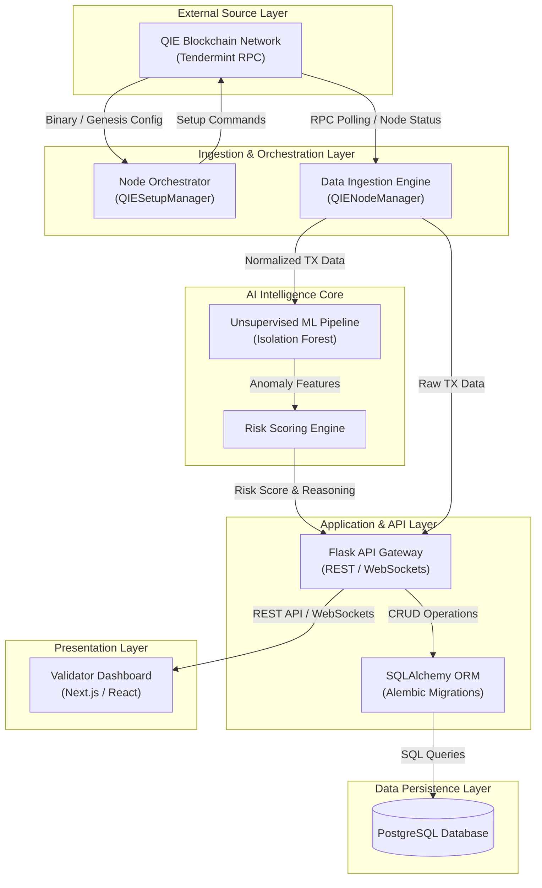

# THE UNIVERSITY OF LAHORE
## Department of Software Engineering
### Final Year Project Proposal
**DATE:** 3 / 2 / 2025

**PROJECT TITLE:** Anomaly Detection & Real-Time Security Monitoring for Blockchain

---

### PROBLEM STATEMENT

Cross-chain bridges have become the critical vulnerability of the Web3 ecosystem, responsible for over $2.5 billion in losses in 2022 due to hacks like the Ronin and Wormhole exploits. Currently, blockchain validators operate blindly, signing transactions without 'semantic visibility' into whether a transfer is legitimate or malicious. There is a lack of real-time tools that allow validators to detect anomalies such as sudden volume spikes or flagged wallet interactions leaving networks exposed to systemic theft until it is too late. 

---

### EXECUTIVE SUMMARY
* **Project Overview:** ValiGuard Al is an intelligent security dashboard designed specifically for QIE Blockchain validators to transition them from "passive signers" to "active security guardians."
* **Core Functionality:** It combines automated node management with an AI-driven security layer that monitors cross-chain bridge transactions in real-time.
* **AI Detection:** The system uses unsupervised machine learning to calculate "risk scores" for every transaction, analyzing volume, frequency, and temporal patterns to flag anomalies (e.g., a 10x spike at 3 AM).
* **Unified Dashboard:** Validators are provided with a "single pane of glass" interface to view node health, sync status, and color-coded risk alerts.
* **Technical Solution:** Built on a Python/Flask backend with automated orchestration scripts for QIE nodes, it features a Next.js frontend for visualization and a custom ML pipeline for threat detection.
* **Impact:** By flagging suspicious activity before final settlement, ValiGuard Al aims to prevent catastrophic bridge hacks and restore trust in cross-chain infrastructure.

---

### INTRODUCTION
The rapid expansion of the blockchain ecosystem has created a fragmented landscape where 'cross-chain bridges' serve as essential connectors. However, these bridges have also become the primary target for cyberattacks, with high-profile exploits draining billions of dollars in user funds. The root cause of many of these incidents is that validators the entities responsible for securing the network are often doing their cryptographic work correctly but lack the tools to assess the intent or risk of the transactions they process.

ValiGuard Al addresses this security gap by introducing an active monitoring layer for the QIE Blockchain. Unlike standard block explorers that only show what has happened, ValiGuard uses Machine Learning to analyze what is currently happening. By establishing historical baselines for transaction volume and frequency, the system can instantly identify deviations indicative of an exploit in progress. This project merges blockchain infrastructure (node operations) with cybersecurity principles (anomaly detection) to create a proactive defense mechanism for decentralized networks.

---

### COMPETITORS/COMPETITIVE ANALYSIS
* **Forta Network:** A decentralized monitoring network where developers build "bots" to detect anomalies and trigger alerts on smart contracts and transactions.
* **Hypernative:** An Al-powered platform that stops hacks before they happen by monitoring off-chain and on-chain data to predict exploits.
* **Tenderly:** A comprehensive developer platform for real-time monitoring, alerting, and transaction simulation.

---

### OBJECTIVES
* To develop a Real-Time Security Monitoring system that inspects all cross-chain bridge transactions on the QIE network.
* To implement an Al-driven Anomaly Detection pipeline that calculates risk scores based on transaction volume, frequency, and temporal patterns.
* To create a Unified Validator Dashboard that visualizes node health, sync status, and security alerts in a single interface.
* To automate the complex process of QIE validator node setup and orchestration using Python scripts.

---

### MOTIVATION
The motivation for Valiguard Al stems from the devastating financial and reputational impact of recent bridge hacks, such as the $600M+ Ronin exploit. We realized that the industry currently treats validators as passive infrastructure providers, ignoring their potential role as the first line of defense. We are motivated to change this paradigm by equipping validators with 'semantic visibility.' It is not enough to know that a transaction happened; the network needs to know if that transaction should happen. By building a tool that fuses operational ease with advanced Al security, we aim to make the QIE network one of the safest ecosystems for cross-chain value transfer.

---

### REQUIREMENTS
#### Functional Requirements:

1. **Automated Node Orchestration Module**
   * The system must provide executable Python scripts, to fully automate the deployment process of a QIE validator node.
   * The system must automatically handle the synchronization process of the validator node with the QIE blockchain network.

2. **Real-Time Data Ingestion Pipeline**
   * The backend system must continuously ingest live transaction data directly from the QIE mainnet.
   * The system must establish connections to monitor both the network's mempool and standard RPC interfaces in real-time to capture pending and confirmed transactions.

3. **Al-Powered Anomaly Scoring Engine**
   * The integrated machine learning engine must process every ingested transaction to dynamically compute a quantitative risk score.
   * The system must restrict this calculated risk score to a standardized range of 0 to 100.
   * The system must evaluate and assign this score based on the transaction's statistical deviation from established historical baselines.

4. **Real-Time Alerting Mechanism**
   * The system must monitor transaction risk scores and trigger instant notifications the moment predefined security thresholds are breached.
   * The system must automatically classify and label all triggered alerts into three distinct severity tiers: Critical, High, or Medium.

5. **Unified Dashboard Visualization**
   * The frontend interface must render a live, continuously updating feed of network transactions.
   * The dashboard must apply intuitive, color-coded visual indicators to represent the specific risk level of each transaction in the feed.
   * The system must generate and display real-time graphical charts illustrating overall bridge traffic.

6. **Historical Analysis and Auditing**
   * The system must retain a database of flagged events and allow users to actively query past alerts.
   * The system must display the explicit contextual reasoning behind every flagged transaction, such as indicating a "10x volume spike", to assist in manual auditing.

#### Non-Functional Requirements:
* **Latency:** Anomaly detection inference must complete in under 100ms per transaction to ensure real-time relevance.
* **Scalability:** The architecture must handle high throughput during periods of network congestion without crashing.
* **Usability:** The dashboard must be responsive and intuitive, using visual cues (red/green) to make complex security data instantly readable.
* **Compatibility:** The system must be fully compatible with QIE Network V3 and standard EVM RPC interfaces.
* **Modularity:** The ML model must be swappable to allow for future upgrades to advanced algorithms (e.g., Graph Neural Networks).

---

### FEATURES OF PROJECT
* **Automated Node Orchestration:** A Python engine that automates the deployment and synchronization of QIE validator nodes to reduce setup time.
* **Unsupervised Anomaly Detection:** Uses machine learning to detect unknown attack vectors by analyzing deviations from historical transaction baselines.
* **Dynamic Risk Scoring:** Assigns a real-time risk probability (0-100) to every transaction, automatically adjusting sensitivity based on network traffic.
* **Cross-Chain Normalization:** A backend layer that standardizes data formats from different bridges into a unified schema for consistent analysis.
* **Real-Time Risk Feed:** Pushes security alerts and transaction updates to the dashboard instantly via WebSockets with sub-100ms latency.
* **Unified Validator Dashboard:** Combines security alerts with critical operational metrics like Sync Status and Voting Power in a single interface.
* **Bridge Traffic Analytics:** Visualizes real-time transaction volumes and liquidity flows using interactive charts to spot macro-level anomalies.
* **Mempool Monitoring:** Connects directly to the QIE Mainnet RPC to inspect and flag pending transactions before they are confirmed in a block.

---

### ARCHITECTURAL DESIGN
ValiGuard AI employs a layered, multi-tier architecture designed to ensure modularity, 
scalability, and clear separation of concerns. The system is decomposed into six distinct layers, each responsible for a specific domain of the application logic. This design ensures that the machine learning pipeline (AI Intelligence Core) can be upgraded independently of the data ingestion layer or the frontend presentation layer.

**Architectural Layers:**
* **External Source Layer:** Represents the QIE Blockchain network. The system interacts with this layer strictly through Tendermint RPC interfaces to read mempool data, block states, and node health.
* **Ingestion and Orchestration Layer:** The operational bridge between the blockchain and the application. It handles the automated setup of validator nodes and the continuous polling of transaction data.
* **AI Intelligence Core:** The analytical engine of the system. It receives normalized 
transaction data, extracts temporal and volumetric features, and executes unsupervised machine learning algorithms to compute risk scores. 
* **Application and API Layer:** The central gateway built on Python/Flask. It 
manages business logic, handles REST API requests, orchestrates database transactions via SQLAlchemy, and pushes real-time alerts. 
* **Presentation Layer:** The client-facing interface built with Next.js and React. It 
consumes the API layer to render the unified dashboard, visualizing node metrics 
and color-coded security alerts.
* **Data Persistence Layer:** The structural storage foundation of the system. Utilizing 
SQLAlchemy as the ORM and PostgreSQL as the primary relational database (with SQLite for development), this layer persists all normalized transactions, computed anomaly scores, generated alerts, and validator state. It ensures data durability for real-time querying, historical auditing, and future ML model retraining. 

---

### IMPLEMENTATION TOOLS AND TECHNIQUES
* **Python & Flask:** Primary backend language and API framework for data orchestration.
* **Next.js & React:** Used for building the responsive, real-time dashboard frontend.
* **Scikit-learn & NumPy:** Core libraries for the Machine Learning anomaly detection pipeline.
* **QIE Network V3 (qied):** The specific blockchain client used for direct RPC calls and node management.
* **WebSockets:** Enables the "live feed" feature for instant transaction updates on the dashboard.
* **PostgreSQL & SQLAlchemy:** Relational database and ORM for managing structured data (alerts, nodes).
* **Chart.js:** Visualization library used for rendering bridge traffic analytics.

---
